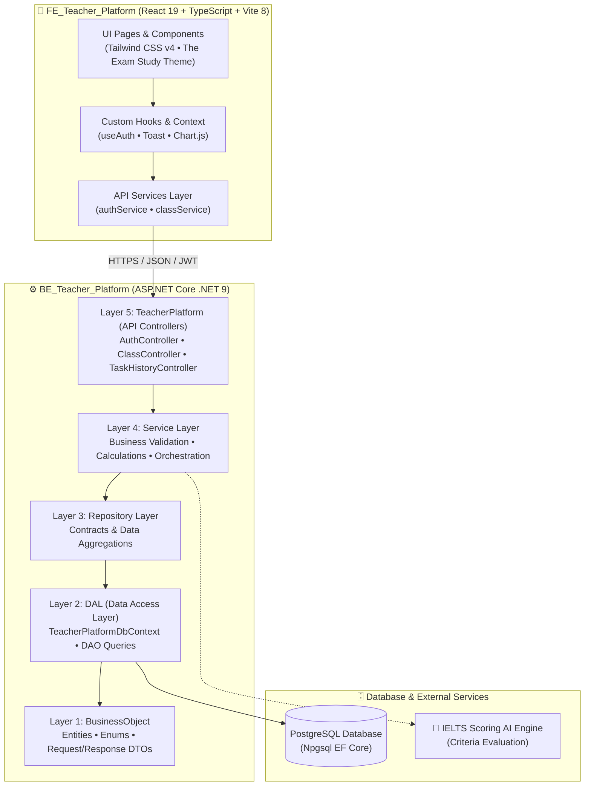
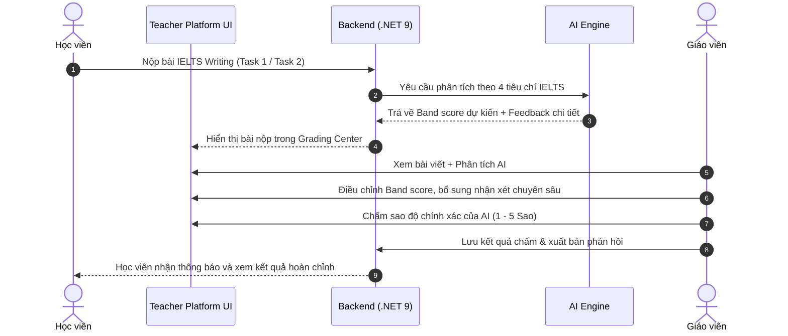

<div align="center">

# 🎓 WISPACE TEACHER PLATFORM
### *Intelligent IELTS Writing Assessment & Classroom Management Ecosystem*

[](https://dotnet.microsoft.com/)
[](https://react.dev/)
[](https://www.typescriptlang.org/)
[](https://vitejs.dev/)
[](https://tailwindcss.com/)
[](https://www.postgresql.org/)

<p align="center">
  <b>Nền tảng toàn diện hỗ trợ giáo viên IELTS: Quản lý lớp học, phân phối bài tập Task 1 & Task 2, chấm điểm chuyên sâu theo 4 tiêu chí chuẩn IELTS kết hợp sức mạnh phân tích từ AI.</b>
</p>

---

[🎯 Scope & Sứ Mệnh](#-scope--sứ-mệnh-dự-án) • 
[✨ Tính Năng Cốt Lõi](#-tính-năng-cốt-lõi) • 
[🏛️ Kiến Trúc Hệ Thống](#️-kiến-trúc-hệ-thống) • 
[🔄 Quy Trình Chấm Điểm](#-quy-trình-chấm-điểm--feedback) • 
[🛠️ Công Nghệ](#️-công-nghệ-sử-dụng) • 
[🚀 Hướng Dẫn Cài Đặt](#-hướng-dẫn-cài-đặt--chạy-local) • 
[📁 Cấu Trúc Dự Án](#-cấu-trúc-thư-mục-monorepo)

---

</div>

<br/>

## 🎯 Scope & Sứ Mệnh Dự Án

Trong luyện thi **IELTS Writing**, việc chấm bài và phản hồi thường tiêu tốn tới 70% thời gian của giáo viên và dễ bị phân mảnh qua file word, email hoặc bảng tính. **Wispace Teacher Platform** được sinh ra để trở thành trạm điều phối trung tâm (*"The Exam Study"*), giải quyết triệt để các vấn đề:

<table width="100%">
  <tr>
    <td width="50%" valign="top">
      <h3 style="color:#183A68">❌ Khó Khăn Truyền Thống</h3>
      <ul>
        <li><b>Chấm thủ công phân tán:</b> Nhận bài qua email/Google Docs, thiếu hệ thống theo dõi tiến độ tổng thể.</li>
        <li><b>Feedback chưa đồng nhất:</b> Khó bám sát đủ 4 tiêu chí chuẩn của British Council / IDP cho từng học viên.</li>
        <li><b>Không đo lường được tiến bộ:</b> Dữ liệu điểm số bị rời rạc, khó phát hiện điểm nghẽn của từng lớp.</li>
        <li><b>Quá tải khối lượng bài viết:</b> Không đủ thời gian phân tích chi tiết lỗi ngữ pháp & từ vựng cho mọi bài nộp.</li>
      </ul>
    </td>
    <td width="50%" valign="top">
      <h3 style="color:#1FB2AA">✅ Giải Pháp Wispace</h3>
      <ul>
        <li><b>Quản lý lớp tập trung:</b> Tổ chức lớp học qua mã mời (Class Code), phân loại sĩ số và tiến độ nộp bài.</li>
        <li><b>AI Co-Pilot chuẩn 4 tiêu chí:</b> AI chấm sơ bộ theo <b>TR/TA, CC, LR, GRA</b> giúp giáo viên tiết kiệm 60% thời gian.</li>
        <li><b>Chấm điểm & Override thông minh:</b> Giáo viên có quyền chỉnh sửa điểm, gắn sao đánh giá độ chuẩn xác của AI, bổ sung ghi chú chuyên sâu.</li>
        <li><b>Dashboard phân tích trực quan:</b> Biểu đồ phân bổ Band điểm, xu hướng tiến bộ và cảnh báo học viên cần kèm cặp.</li>
      </ul>
    </td>
  </tr>
</table>

<br/>

---

## ✨ Tính Năng Cốt Lõi

### 1. 🏫 Quản Lý Lớp Học & Học Viên (Classroom Hub)
* **Tạo & quản lý lớp học:** Khởi tạo lớp học theo trình độ mục tiêu (IELTS 5.5, 6.5, 7.5+), lịch học và sĩ số.
* **Mã mời lớp học (Invite Code):** Học viên tham gia lớp nhanh chóng qua mã định danh duy nhất.
* **Hồ sơ tiến độ học viên:** Theo dõi danh sách bài nộp, tỷ lệ hoàn thành bài tập và biến động band score của từng học viên theo thời gian.

### 2. 📑 Quản Lý Đề Thi & Bài Tập (Assignment Studio)
* **Kho bài viết chuẩn hóa:**
  * **Task 1 (Academic & General):** Hỗ trợ đầy đủ Bar chart, Line graph, Pie chart, Table, Map, Process diagram và Letter format.
  * **Task 2:** Dạng bài Opinion, Discussion, Problem-Solution, Two-part question.
* **Giao bài & Giới hạn thời gian:** Thiết lập Deadline, lớp áp dụng, chỉ định đề thi và hướng dẫn làm bài chi tiết.
* **Bộ đếm trạng thái nộp bài:** Tự động thống kê số bài đã nộp, chưa nộp và bài nộp trễ hạn.

### 3. ✍️ Trung Tâm Chấm Điểm & Phản Hồi (Grading & Feedback Center)
* **Ma trận 4 tiêu chí IELTS Writing:**
  * 🎯 **Task Achievement / Task Response (TA/TR)**
  * 🔗 **Coherence & Cohesion (CC)**
  * 📚 **Lexical Resource (LR)**
  * 📐 **Grammatical Range & Accuracy (GRA)**
* **Giao diện đối chiếu song song (Side-by-Side):**
  * Hiển thị đề bài, bài viết học viên, gợi ý AI và khung nhập nhận xét của giáo viên trên cùng một không gian làm việc.
* **Điểm mạnh & Hướng khắc phục:** Phân loại rõ ràng điểm tích cực cần phát huy và các lỗi trọng tâm cần khắc phục trong bài viết kế tiếp.
* **Đánh giá AI (Teacher AI Rating):** Giáo viên chấm sao (1 - 5 ⭐) và đánh giá độ chính xác của AI để làm giàu dữ liệu tinh chỉnh mô hình.

### 4. 📈 Báo Cáo & Phân Tích Tiến Độ (Analytics & Progress)
* **Biểu đồ phân phối điểm số:** Thống kê phổ điểm cả lớp theo từng tiêu chí để điều chỉnh giáo án giảng dạy.
* **Bảng theo dõi cá nhân hóa:** Xem hành trình cải thiện band điểm từ bài đầu tiên đến bài gần nhất của từng bạn.

<br/>

---

## 🏛️ Kiến Trúc Hệ Thống

Dự án áp dụng mô hình **N-Layer Separation Architecture** chuẩn mực cho Backend (.NET 9) kết hợp **Modern Single Page Application** tối ưu hiệu năng cho Frontend (React 19 + Vite 8).



<br/>

---

## 🔄 Quy Trình Chấm Điểm & Feedback



<br/>

---

## 🛠️ Công Nghệ Sử Dụng

<div align="center">

| Phân Hệ | Công Nghệ | Phiên Bản | Công Dụng Chính |
|:---:|:---:|:---:|:---|
| **Frontend** | `React` | 19.2 | Thư viện UI hiện đại với hiệu năng render vượt trội |
| **Frontend** | `TypeScript` | 6.0 | Đảm bảo an toàn kiểu dữ liệu 100% |
| **Frontend** | `Vite` | 8.2 | Build tool siêu tốc và tối ưu hóa tài nguyên |
| **Frontend** | `Tailwind CSS` | v4.3 | Hệ thống Styling hiện đại bám sát chuẩn Design System |
| **Frontend** | `Wouter` | 3.11 | Routing nhẹ, tối giản và tải trang tức thì |
| **Frontend** | `Chart.js` | 4.5 | Biểu đồ trực quan hóa phổ điểm và tiến độ học tập |
| **Frontend** | `Lucide React` | 1.41 | Bộ icon sắc nét, đồng bộ cho toàn bộ giao diện |
| **Frontend** | `Oxlint` | 1.79 | Công cụ linter cực nhanh chuẩn Rust |
| **Backend** | `.NET ASP.NET Core` | 9.0 | Nền tảng Web API hiệu năng cao, bảo mật |
| **Backend** | `Entity Framework Core` | 9.0 | ORM truy vấn dữ liệu theo mô hình DAO sạch |
| **Backend** | `Npgsql PostgreSQL` | Latest | Hệ quản trị cơ sở dữ liệu quan hệ mạnh mẽ |
| **Backend** | `JWT Bearer` | Latest | Xác thực & phân quyền bảo mật cấp độ Role (Teacher) |
| **Testing** | `xUnit` | Latest | Kiểm thử tự động cho các tầng Service & Repository |

</div>

<br/>

---

## 🎨 Design System: "The Exam Study"

Giao diện của Wispace hướng tới sự **tập trung, chuẩn mực học thuật và tự tin**:

* 🟦 **Deep Navy (`#183A68`):** Màu thương hiệu chủ đạo, sử dụng cho thanh điều hướng, nút hành động chính và các tiêu đề lớn.
* 🔷 **Navy Light (`#EAF2FD`):** Nền tinted cho các khu vực tương tác, hover và card phụ.
* 🟩 **Exam Teal (`#1FB2AA`):** Điểm nhấn thành công, chỉ báo tích cực và hoàn thành xuất sắc.
* 🟧 **Highlight Amber (`#F5A623`):** Cảnh báo, bài cần chấm gấp, lưu ý quan trọng.
* 📄 **Study Sheet (`#F1F3FC`):** Màu nền êm dịu, mô phỏng trang giấy thi sạch sẽ, bảo vệ mắt khi chấm bài lâu.
* 🔲 **Flat Border Separation:** Sử dụng viền 1px mỏng (`#E2E8F0`) thay cho drop shadow nặng nề, giữ giao diện phẳng và thanh thoát.

<br/>

---

## 📁 Cấu Trúc Thư Mục Monorepo

```
Teacher-Ielts-Platform/
├── BE_Teacher_Platform/                      # Backend .NET 9 Web API
│   └── Teacher_Platform/
│       ├── Teacher_Platform.sln              # Solution quản lý các project
│       ├── BusinessObject/                   # Layer 1: Entities, Enums, Request/Response DTOs
│       ├── DAL/                              # Layer 2: DbContext, DAO (EF Core Queries), Migrations
│       ├── Repository/                       # Layer 3: Interfaces & Repository Implementations
│       ├── Service/                          # Layer 4: Business Logic, Rules, Calculations
│       ├── TeacherPlatform/                  # Layer 5: Web API Controllers, Middlewares, Program.cs
│       └── TeacherPlatform.Tests/            # Unit & Integration Tests (xUnit)
│
├── FE_Teacher_Platform/                      # Frontend React 19 + TypeScript + Vite
│   ├── public/                               # Static assets (Favicons, images)
│   ├── src/
│   │   ├── assets/                           # Logo, graphics, icons
│   │   ├── components/                       # UI primitives (Button, Input, Modal, Toast)
│   │   ├── hooks/                            # Custom React hooks (use-auth, use-toast)
│   │   ├── lib/                              # Infrastructure clients & auth helper
│   │   ├── pages/                            # Các màn hình chức năng chính
│   │   │   ├── login.tsx                     # Đăng nhập giáo viên
│   │   │   ├── register.tsx                  # Đăng ký tài khoản giáo viên mới
│   │   │   ├── teacher-home.tsx              # Dashboard tổng quan lớp học
│   │   │   ├── grading-center.tsx            # Trung tâm chấm bài & quản lý bài nộp
│   │   │   ├── teacher-feedback.tsx          # Giao diện chấm chi tiết 4 tiêu chí
│   │   │   ├── class-progress.tsx            # Biểu đồ & tiến độ học tập của lớp
│   │   │   ├── assignment-management.tsx     # Quản lý đề thi & bài tập đã giao
│   │   │   └── assignment-detail.tsx         # Chi tiết đề thi & danh sách nộp bài
│   │   ├── services/                         # Kết nối API Backend (authService, classService)
│   │   ├── types/                            # Kiểu dữ liệu TypeScript dùng chung
│   │   ├── App.tsx                           # Router phân quyền & Routes setup
│   │   └── index.css                         # Tailwind CSS v4 & theme variables
│   ├── .env                                  # Biến môi trường Frontend (VITE_BACKEND)
│   └── package.json                          # Scripts & dependencies
│
├── .claude/                                  # Trợ lý Claude Code rules, commands, hooks
├── CLAUDE.md                                 # Hướng dẫn kiến trúc & quy chuẩn phát triển
└── README.md                                 # Tài liệu tổng quan dự án
```

<br/>

---

## 🚀 Hướng Dẫn Cài Đặt & Chạy Local

### Điều Kiện Tiên Quyết
- [.NET 9.0 SDK](https://dotnet.microsoft.com/download/dotnet/9.0)
- [Node.js](https://nodejs.org/) (khuyến nghị v20+)
- [PostgreSQL](https://www.postgresql.org/) (khởi chạy local hoặc remote database)

---

### Bước 1: Khởi Chạy Backend API

1. Điều hướng vào thư mục API project:
   ```bash
   cd BE_Teacher_Platform/Teacher_Platform/TeacherPlatform
   ```

2. Cấu hình chuỗi kết nối Database tại `appsettings.Development.json`:
   ```json
   {
     "ConnectionStrings": {
       "DefaultConnection": "Host=localhost;Port=5432;Database=TeacherPlatformDb;Username=postgres;Password=your_password"
     }
   }
   ```

3. Cập nhật cơ sở dữ liệu qua EF Core:
   ```bash
   cd ..
   dotnet ef database update --project DAL --startup-project TeacherPlatform --context TeacherPlatformDbContext
   ```

4. Chạy Backend API:
   ```bash
   cd TeacherPlatform
   dotnet run
   ```
   * 🌐 **API Base URL:** `https://localhost:7244` hoặc `http://localhost:5269`
   * 📖 **Swagger Documentation:** `https://localhost:7244/swagger`

---

### Bước 2: Khởi Chạy Frontend SPA

1. Mở một cửa sổ Terminal mới và di chuyển vào thư mục Frontend:
   ```bash
   cd FE_Teacher_Platform
   ```

2. Cài đặt các thư viện phụ thuộc:
   ```bash
   npm install
   ```

3. Kiểm tra biến môi trường `.env`:
   ```env
   VITE_BACKEND=https://localhost:7244
   ```

4. Bật chế độ chạy dev:
   ```bash
   npm run dev
   ```
   * 🚀 **Ứng dụng truy cập tại:** `http://localhost:5173`

---

### Bước 3: Kiểm Thử & Linter

```bash
# Chạy Unit Tests Backend
cd BE_Teacher_Platform/Teacher_Platform
dotnet test Teacher_Platform.sln

# Kiểm tra Type & Build Frontend
cd FE_Teacher_Platform
npm run build

# Kiểm tra Linter Frontend siêu tốc
npm run lint
```

<br/>

---

## 🛡️ Bảo Mật & Phân Quyền (Security & Access Control)

* **JWT Stateless Authentication:** Mã hóa token chuẩn với thời hạn và refresh token định kỳ.
* **Role-based Guard (`TeacherOnlyRoute`):** Đảm bảo chỉ người dùng có quyền `Teacher` mới có thể truy cập vào khu vực quản lý lớp và trung tâm chấm điểm.
* **Tách Biệt Lớp Tuyệt Đối:** API Controllers không truy cập trực tiếp tầng DAO hoặc Database, ngăn chặn triệt để rò rỉ cấu trúc dữ liệu nội bộ.
* **Payload Sanitation:** Loại bỏ hoàn toàn các thông tin nhạy cảm trước khi phản hồi về Client qua các DTO chuẩn mực.

<br/>

---

<div align="center">

**Wispace Teacher Platform** — *Nâng tầm chuẩn mực chấm thi và đào tạo IELTS Writing.*  
Developed with ❤️ by the **Wispace Engineering Team**.

</div>
